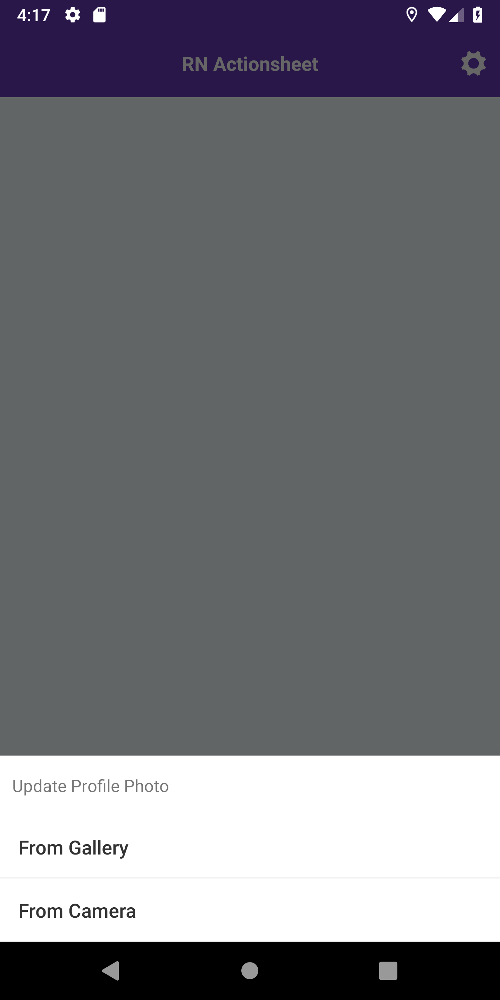
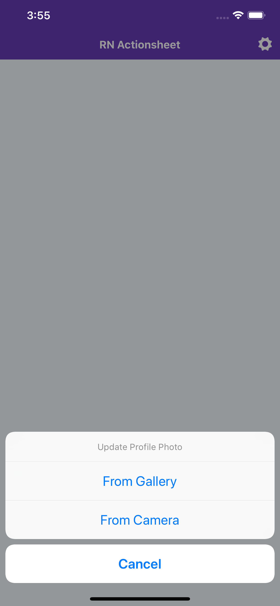

# React Native ActionSheet
This package will help you to using ActionSheetIOS(IOS) and BottomSheetDialog(Android). 

Usage of this package same as for IOS and Android. Also this package usage same as [ActionSheetIOS](https://facebook.github.io/react-native/docs/actionsheetios)

Using [`ActionSheetIOS`](https://facebook.github.io/react-native/docs/actionsheetios) component for IOS and using `RecyclerView` and `BottomSheetDialog` for Android as `NativeModule`. 

 

### Version >= 1.0.0 now has AndroidX support. If you want to use this package without AndroidX support please use v0.2.3
#### Facebook RN blog post about v0.60 and AndroidX support: [https://facebook.github.io/react-native/blog/2019/07/03/version-60](https://facebook.github.io/react-native/blog/2019/07/03/version-60)

### Version 1.0.3
- `tintColor` added for IOS

#### Version 1.0.2
- `implementation 'com.google.android.material:material:1.0.0'` issue solved

## Getting Started

**With NPM**

```
npm install --save rn-actionsheet-module
```

**With YARN**

```
yarn add rn-actionsheet-module
```


#### After React Native v0.60 you don't need to link anything. [Native Modules are now Autolinked](https://facebook.github.io/react-native/blog/2019/07/03/version-60#native-modules-are-now-autolinked)

**Automatic linking**

```
react-native link rn-actionsheet-module
```

**Manual Linking**

**[Manual Installation](/docs/manual-installation.md)** (If something went wrong with react-native link)

## Props

| Props                 | Type | Required | OS         |
|-----------------------|------|----------|------------|
|optionsIOS             |array |**Yes**   |IOS         |
|optionsAndroid         |array |**Yes**   |Android     |
|title                  |string|**Yes**   |Android, IOS|
|message                |string|No        |IOS         |    
|tintColor              |string|No        |IOS         |    
|destructiveButtonIndex |number|No        |IOS         |
|cancelButtonIndex      |number|No        |IOS         |
|onCancelAndroidIndex   |number|**Yes**   |Android     |

##### With v0.2.0
_Android doesn't need any cancel option but back button or outside click will return `onCancelAndroidIndex`_
## Usage

```javascript
import ActionSheet from 'rn-actionsheet-module'

<TouchableOpacity onPress={() => {
   ActionSheet(
       {
          title             : "Lorem ipsum",
          optionsIOS        : ["Cancel", "From Gallery", "From Camera"],
          optionsAndroid        : ["From Gallery", "From Camera"],
          destructiveButtonIndex: null, // undefined // 1, 2, etc.,
          cancelButtonIndex     : 0, // 
          onCancelAndroidIndex: 3 // android doesn't need any cancel option but back button or outside click will return onCancelAndroidIndex
       }, (index) => {
        switch (index) {
         case Platform.OS === "ios" ? 1 : 0 :{
           alert("From Camera clicked")
         }
         case Platform.OS === "ios" ? 2 : 1 :{
           alert("From Camera clicked")
         }
         case Platform.OS === "ios" ? 0 : 3 :{
           alert("onCancel")
         }
         default:{
           alert("Default")
         }
        }
       }
   )
}}>
  <Text>Show ActionSheet</Text>
</TouchableOpacity>
```

## FYI
You can use more than one ActionSheet in same screen.

## License
This project is licensed under the MIT License - see the [LICENSE.md](./LICENSE.md) file for details
